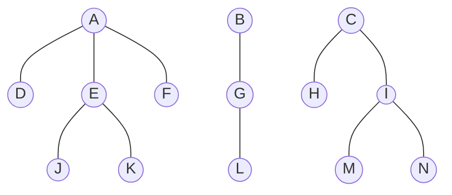

# 四．简答（24 分，每小题 6 分）

1、树周游算法可以很好地应用到森林的周游上。查看下列森林结构，请给出其深度优先周游序列和广度优先周游序列。



Answer:

深度优先：ADEJKFBGLCHIMN；广度优先：ABCDEFGHIJKLMN

> 森林的广度优先周游序列定义如下：
>
> 1. 从森林中的每棵树的根节点开始，将根节点加入到遍历队列中。
> 2. 从队列中取出一个节点，并将其加入到遍历结果中。
> 3. 将该节点的所有未被访问过的子节点加入到队列中。
> 4. 重复步骤2和步骤3，直到队列为空。
>
> 在广度优先周游序列中，每一层的节点按照从左到右的顺序加入到遍历结果中。这确保了每棵树的每一层都会被遍历到，而且同一层的节点会按照从左到右的顺序被遍历。


2、哈夫曼树是进行编码的一种有效方式。设给定五个字符，其相应的权值分别为 {4， 8， 6， 9， 18}，试画出相应的哈夫曼树，并计算它的带权外部路径长度 WPL 。


为了构建哈夫曼树，我们需要按照权值从小到大对字符进行排序，并不断地合并权值最小的两个节点，直到只剩下一个节点为止。这个节点就是哈夫曼树的根节点。每次合并两个节点时，新节点的权值为这两个节点的权值之和。

下面是构建哈夫曼树的过程：

1. 将给定的五个字符按照权值从小到大排序：
   1. {4， 6， 8， 9， 18}

2. 不断合并权值最小的两个节点，直到只剩下一个节点：
   1. 合并 4 和 6，得到节点 a，权值为 10
   2. 合并 8 和 9，得到节点 b，权值为 17
   3. 合并节点 a 和 b，得到节点c，权值为 27
   4. 合并节点c和 18，得到根节点d，权值为45

下面是相应的哈夫曼树：

```
          （45）
          /   \
        (27)   18
        /   \
   (10)       (17)
   /  \       /   \
  4    6     8     9
```

计算带权外部路径长度（WPL）：
WPL = 4 * 3 + 6 * 3 + 8 * 3 + 9 * 3 + 18 * 1
    = 12 + 18 + 24 + 27 + 18
    = 99

所以，哈夫曼树的带权外部路径长度为 99。


3、 下图是一棵完全二叉树：
1） 请根据初始建堆算法对该完全二叉树建堆，请画出构建的小根堆（2 分）；
2）基于（1）中得到的堆，删除其中的最小元素，请用图给出堆的调整过程（2 分）；
3）基于（1）中得到的堆，向其中插入元素 2，请给出堆的调整过程（2 分）。
注：每移动一个元素视为一个执行步骤，画出所有执行步骤


```
          31
       /      \
     8         53
   /  \       /   \
  10   20    7    15
 / \	 /
3  20 1
```


解答：

对完全二叉树建堆，给出初始建堆算法python

```python
def heapify(arr):
    n = len(arr)
    # 从最后一个非叶子节点开始，依次向下调整每个节点
    for i in range(n // 2 - 1, -1, -1):
        heapify_down(arr, i, n)

def heapify_down(arr, i, n):
    smallest = i  # 假设当前节点最小
    left_child = 2 * i + 1
    right_child = 2 * i + 2

    # 如果左子节点存在且小于当前节点，则更新最小值索引
    if left_child < n and arr[left_child] < arr[smallest]:
        smallest = left_child

    # 如果右子节点存在且小于当前节点，则更新最小值索引
    if right_child < n and arr[right_child] < arr[smallest]:
        smallest = right_child

    # 如果最小值索引不等于当前节点索引，则交换当前节点和最小值节点的值，并继续向下调整
    if smallest != i:
        arr[i], arr[smallest] = arr[smallest], arr[i]
        heapify_down(arr, smallest, n)

# 测试
arr = [31, 8, 53, 10, 20, 7, 15, 3, 20, 1]
heapify(arr)
print(arr)
# [1, 3, 7, 10, 8, 53, 15, 31, 20, 20]
```


1）根据初始建堆算法，我们从最后一个非叶子节点开始，依次向上调整，保证每个节点都满足小根堆的性质。

```
          3
       /      \
     8         7
   /  \       /   \
  10   20    53    15
 / 	 
31 
```

2）删除最小元素后，将最后一个元素放到根节点，并进行堆调整：

```
         (20)
       /      \
     3         7
   /  \       /   \
  10   8    53    15
 / \	 
31 20 
```


```
          3
       /      \
    (20)         7
   /  \       /   \
  10   8    53    15
 / \	 /
31 20 20
```


```
          3
       /      \
     8         7
   /  \       /   \
  10  (20)    53    15
 / \	 
31 20 
```

3）插入元素 2 后，将元素 2 放到堆的最后，然后进行堆调整：


```
          1
       /      \
     3         7
   /  \       /   \
  10   8    53    15
 / \	 /\
31 20 20 (2)
```


```
          1
       /      \
     3         7
   /  \       /   \
  10  (2)   53    15
 / \	 /\
31 20 20 8
```


```
          1
       /      \
    (2)         7
   /  \       /   \
  10   3    53    15
 / \	 /\
31 20 20 8
```


4、 已知图 G 的顶点集合 V={V0, V1, V2, V3, V4}，邻接矩阵如下图所示， 可用 prim 算法求 G 的最小生成树。
$$
\left[
\matrix{
  0 & 7 & \infty & 4 & 2 \\ 
  7 & 0 & 9 & 1 & 5 \\ 
  \infty & 9 & 0 & 3 & \infty \\ 
  4 & 1 & 3 & 0 & 10 \\ 
  2 & 5 & \infty & 10 & 0
}
\right]
$$


1） 根据邻接矩阵， 画出图 G（2 分）；
2） 根据 prim 算法，求图 G 从顶点 V0 出发的最小生成树（2 分）；
3） 用图表示出最小生成树每一步的生成过程（2 分） 。


# 五．算法（16 分，每小题 8 分）

1、已知下列 pre2post 函数的功能是根据一个满二叉树的前序遍历序列，求其后序遍历序列，请完成填空（假设序列长度不超过 32）。


```python
# 返回先根序列 preorder[start:start+length]对应的后根序列
def pre2post(preorder, start, length):
    if length == 1:
        return preorder[start]  # 1分
    else:
        root=preorder[start] # 2分
		new_len=len(preorder)//2 # 2分
        left=pre2post(preorder,1,new_len) # 2分
        right=pre2post(preorder,1+new_len,1+2*new_len)# 2分
        return left + right + root

print(pre2post("ABC", 0, 3))  # 输出 BCA
print(pre2post("ABDECFG", 0, 7))  # 输出 DEBFGCA
```


2、阅读下列程序，完成图的深度优先周游算法实现的迷宫探索。已知图采用邻接表表示，Graph 类和 Vertex 类基本定义如下：

```python
class Graph:
    def __init__(self):
        self.vertices = {}

    def addVertex(self, key, label): #添加节点，id 为key，附带数据 label
        self.vertices[key] = Vertex(key, label)

    def getVertex(self, key): # 返回 id 为 key 的节点
        return self.vertices.get(key)

    def __contains__(self, key): # 判断 key 节点是否在图中
        return key in self.vertices

    def addEdge(self, f, t, cost=0): # 添加从节点 id==f 到 id==t 的边
        if f in self.vertices and t in self.vertices:
            self.vertices[f].addNeighbor(t, cost)

    def getVertices(self): # 返回所有的节点 key
        return self.vertices.keys()

    def __iter__(self): # 迭代每一个节点对象
        return iter(self.vertices.values())


class Vertex:
    def __init__(self, key, label=None): # 缺省颜色为"white“
        self.id = key
        self.label = label
        self.color = "white"
        self.connections = {}

    def addNeighbor(self, nbr, weight=0): # 添加到节点 nbr 的边
        self.connections[nbr] = weight

    def setColor(self, color): # 设置节点颜色标记
        self.color = color

    def getColor(self): # 返回节点颜色标记
        return self.color

    def getConnections(self): # 返回节点的所有邻接节点列表
        return self.connections.keys()

    def getId(self): # 返回节点的 id
        return self.id

    def getLabel(self): # 返回节点的附带数据 label
        return self.label

#https://github.com/Yuqiu-Yang/problem_solving_with_algorithms_and_data_structures_using_python/blob/master/ch7/ch4_maze2.txt
mazelist = [
    "++++++++++++++++++++++",
    "+   +   ++ ++        +",
    "E     +     ++++++++++",
    "+ +    ++  ++++ +++ ++",
    "+ +   + + ++    +++  +",
    "+          ++  ++  + +",
    "+++++ + +      ++  + +",
    "+++++ +++  + +  ++   +",
    "+          + + S+ +  +",
    "+++++ +  + + +     + +",
    "++++++++++++++++++++++",
]

def mazeGraph(mlist, rows, cols): # 从 mlist 创建图，迷宫有 rows 行 cols 列
    mGraph = Graph()
    vstart = None
    for row in range(rows):
        for col in range(cols):
            if mlist[row][col] != "+":
                mGraph.addVertex((row, col), mlist[row][col])
                if mlist[row][col] == "S":
                    vstart = mGraph.getVertex((row, col)) # 等号右侧填空（1分）

    for v in mGraph:
        row, col = v.getId()
        for i in [(-1, 0), (1, 0), (0, -1), (0, 1)]:
            if 0 <= row + i[0] < rows and 0 <= col + i[1] < cols:
                if (row + i[0], col + i[1]) in mGraph:
                    mGraph.addEdge((row, col), (row + i[0], col + i[1])) #括号中两个参数填空（1分）

    return mGraph, vstart # 返回图对象，和开始节点


def searchMaze(path, vcurrent, mGraph): # 从 vcurrent 节点开始 DFS 搜索迷宫，path 保存路径
    path.append(vcurrent.getId())
    vcurrent.setColor("gray")
    if vcurrent.getLabel() != "E":
        done = False
        for nbr in vcurrent.getconnections(): # in 后面部分填空（2分）
            nbr_vertex = mGraph.getVertex(nbr)
            if nbr_vertex.getColor() == "white":
                done = searchMaze(path+[nbr],nbr_vertex,mGraph) # 参数填空（2分）
                if done:
                    break
        if not done:
            path.pop() # 这条语句空着，填空（2分）
            vcurrent.setColor("white")
    else:
        done = True
    return done # 返回是否成功找到通路


g, vstart = mazeGraph(mazelist, len(mazelist), len(mazelist[0]))
path = []
searchMaze(path, vstart, g)
print(path)

# [(8, 15), (7, 15), (7, 14), (6, 14), (5, 14), (4, 14), (4, 13), (5, 13), (6, 13), (6, 12), (6, 11), (6, 10), (5, 10), (5, 9), (4, 9), (3, 9), (2, 9), (2, 8), (2, 7), (1, 7), (1, 6), (1, 5), (2, 5), (3, 5), (4, 5), (5, 5), (5, 4), (4, 4), (3, 4), (2, 4), (2, 3), (1, 3), (1, 2), (2, 2), (2, 1), (2, 0)]
```


